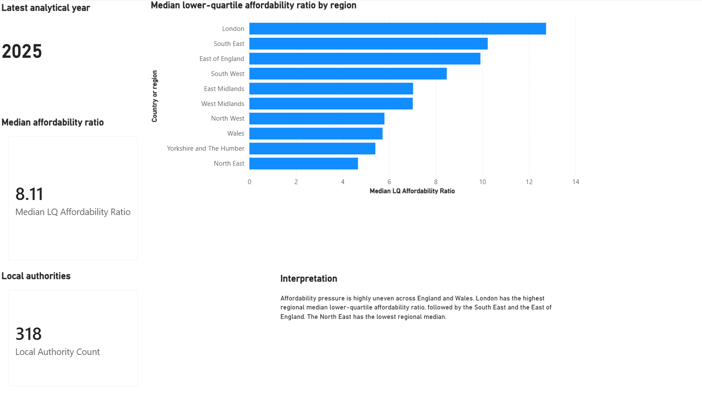
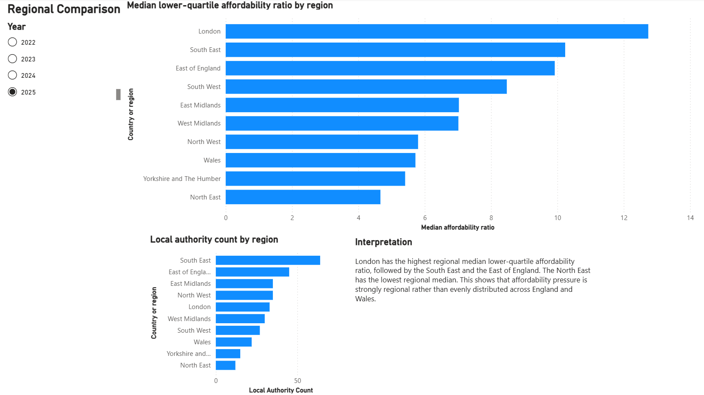
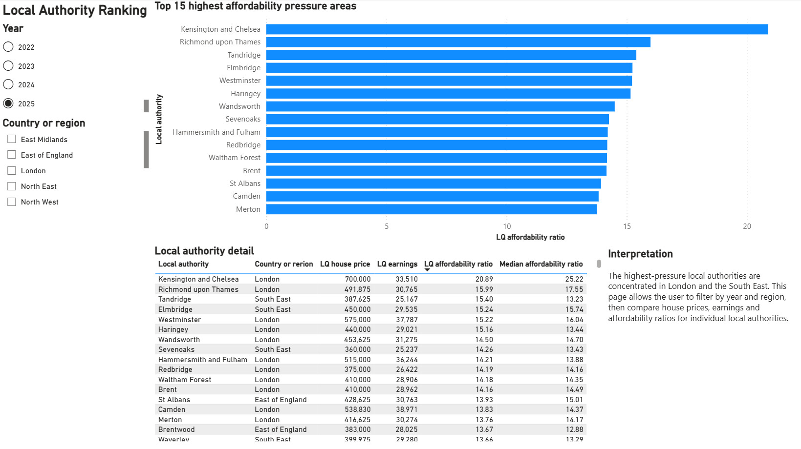
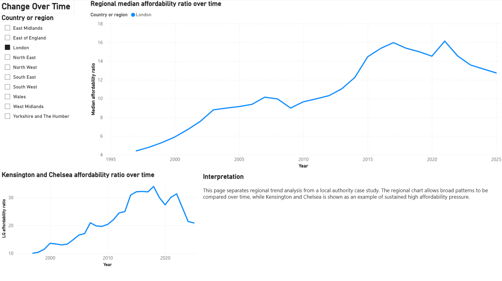
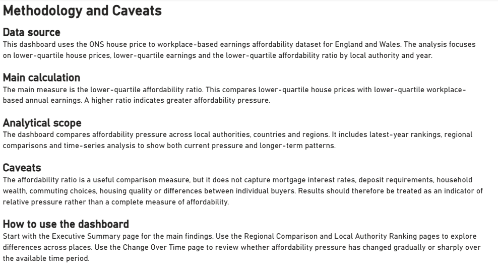

# First-Time Buyer Affordability Pressure by Area

## Executive summary

This project analyses first-time buyer affordability across local authority areas in England and Wales. It uses lower-quartile house price to lower-quartile workplace-based earnings ratios as the primary measure, because this better reflects the entry-level end of the housing market than a headline average or median-only view.

In the 2025 outputs, the highest affordability pressure is concentrated in London and the South East. Kensington and Chelsea has the highest lower-quartile affordability ratio at 20.89, while County Durham has the lowest ratio in the exported least-pressured output at 3.43.

Python exploratory analysis adds a wider distribution view. The 2025 median lower-quartile affordability ratio is 8.11 across valid local authorities. London has the highest regional median at 12.74, while the North East has the lowest at 4.66.

## Project summary

The project uses official housing affordability data to compare entry-level house prices with local earnings. The work is structured as a business-facing analysis rather than a purely descriptive data exercise.

## Why this matters

A national house price average is not enough to understand affordability. Buyers face local prices, local earnings and local constraints. This project focuses on area-level variation so that affordability can be compared more realistically.

## Findings

- The cleaned dataset contains 9,222 area-year records across 318 local authorities per year from 1997 to 2025.
- No duplicate local-authority-year keys were found.
- The latest analytical year is 2025.
- Seven of the top 10 most pressured local authorities in 2025 are in London.
- All London local authorities in the cleaned dataset are either high pressure or severe pressure in the latest-year pressure-band output.
- The least pressured latest-year areas are mainly in the North East, North West and Wales.
- London has the highest regional median lower-quartile affordability ratio at 12.74.
- The North East has the lowest regional median lower-quartile affordability ratio at 4.66.
- Tandridge recorded the largest five-year increase in the exported SQL and Python outputs, rising from 14.07 in 2020 to 15.40 in 2025.

## Recommendations

The final recommendations report translates the analysis into practical stakeholder actions. It recommends using local authority level analysis, treating London and the South East as distinct high-pressure markets, reviewing lower-pressure areas with appropriate caution, and monitoring areas where the ratio has worsened over time.

Read the report here:

[Final recommendations](../reports/final_recommendations.md)

## Outputs completed

- Source collection and profiling notebook.
- Cleaning notebook.
- Cleaned area-year dataset.
- Data dictionary.
- SQL quality checks.
- SQL affordability pressure analysis.
- Exported SQL outputs.
- SQL findings report.
- Python exploratory analysis notebook.
- Python summary outputs.
- Visual outputs.
- Python exploratory findings report.
- Excel review workbook.
- Excel workbook specification.
- Power BI dashboard.
- Power BI dashboard screenshots.
- Final recommendations report.

## Power BI dashboard

The Power BI dashboard is stored at:

```text
power_bi/first_time_buyer_affordability_dashboard.pbix
```

It contains five pages:

1. Executive Summary
2. Regional Comparison
3. Local Authority Ranking
4. Change Over Time
5. Methodology and Caveats

The dashboard is used as the interactive presentation layer. It sits alongside the Excel workbook, SQL outputs, Python notebook and written reports rather than replacing them.

## Dashboard screenshots

### Executive Summary



### Regional Comparison



### Local Authority Ranking



### Change Over Time



### Methodology and Caveats



## Planned final outputs

- Final GitHub Pages polish.
- Final review before merging the project branch.

## Status

Data collection, cleaning, SQL analysis, Python exploratory analysis, Excel review, Power BI dashboard development, dashboard evidence and final recommendations are complete. The project is now in the final polish and review stage.